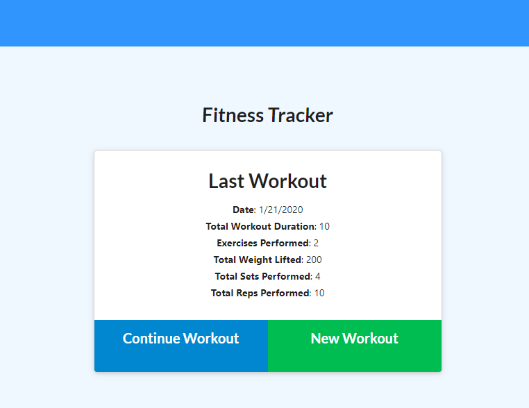
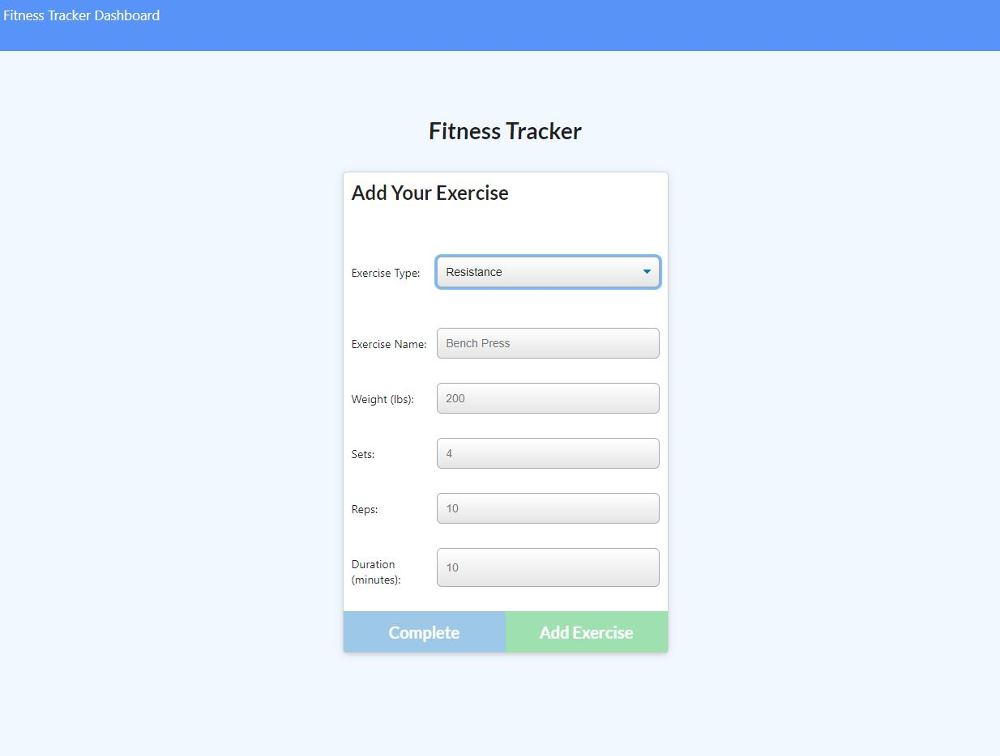
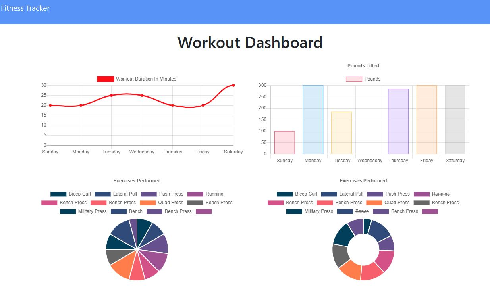

# Fitness Tracker
Allows the user to track a workout. Various attributes of the workout can be stored. The workouts are saved in a Mongo database.

## Description 
Created a fitness tracking app utilizing Node.js, Express.js, MongoDB, Heroku and Mongoose. Majority of the front end code was provided in a homework prompt as part of a web development boot camp. Allows the user to track their workouts and save them in a database.

## Live site: 

## Images
Image of main view:

Image of adding exercises:

Image of Workout Dashboard

